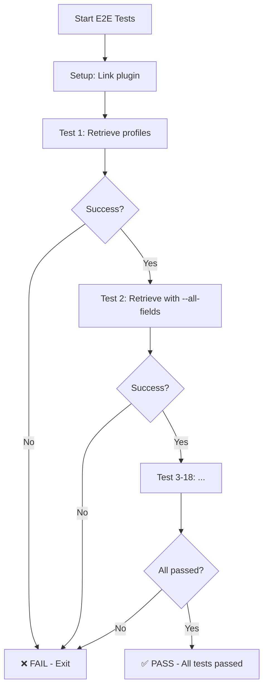

# E2E Test Automation

## Overview

E2E (End-to-End) tests validate the complete functionality of the profiler plugin using **real Salesforce orgs**. Unlike unit tests (fully mocked) or NUT tests (stubbed), E2E tests execute actual commands against live Salesforce environments.

## Test Coverage

The E2E test suite (`scripts/e2e-test.sh`) includes **18 comprehensive tests**:

### Retrieve Tests (8 tests)
- Basic profile retrieval
- Retrieve with `--all-fields` flag
- Retrieve specific profile by name
- Retrieve with `--documentation` flag
- Incremental retrieve (default behavior)
- Force retrieve (`--force` flag)
- Dry-run preview (`--dry-run` flag)
- Safety validation (canary file test)

### Compare Tests (7 tests)
- Single profile comparison (local vs org)
- All profiles comparison
- Compare with specific retrieval type
- Multi-source comparison (`--sources` flag)
- JSON output format
- HTML output with file export
- Table output (default)

### Docs Tests (1 test)
- Documentation generation

### Validate Tests (2 tests)
- Profile validation
- Validation with deployment check

## Architecture

### Workflow Structure

```
┌────────────────────────────────────────────────────────────┐
│         .github/workflows/test.yml (Main)                  │
│                                                            │
│  Trigger: push to branches or workflow_dispatch           │
│                                                            │
│  ┌──────────────┐    ┌──────────────┐    ┌─────────────┐ │
│  │  Unit Tests  │───▶│  NUT Tests   │───▶│  E2E Tests  │ │
│  │   (~2 min)   │    │   (~5 min)   │    │  (optional) │ │
│  └──────────────┘    └──────────────┘    └──────┬──────┘ │
│       Always              Always              Conditional │
│                                                     │      │
└─────────────────────────────────────────────────────┼──────┘
                                                      │
                                    if run_e2e=true  │
                                                      ▼
┌────────────────────────────────────────────────────────────┐
│         .github/workflows/e2e.yml (Sub-workflow)           │
│                                                            │
│  Can be triggered:                                        │
│  • Called by test.yml (workflow_call)                     │
│  • Manually (workflow_dispatch)                           │
│  • Scheduled (optional, disabled by default)              │
│                                                            │
│  ┌────────────────────────────────────────┐               │
│  │ 1. Build plugin                        │               │
│  │ 2. Authenticate to test org            │               │
│  │ 3. Link plugin locally                 │               │
│  │ 4. Execute scripts/e2e-test.sh         │               │
│  └────────────────────────────────────────┘               │
└────────────────────────────────────────────────────────────┘
                       ▼
┌─────────────────────────────────────────────────┐
│              scripts/e2e-test.sh                 │
│                                                  │
│  • 18 test cases                                │
│  • Real sf CLI commands                         │
│  • Real Metadata API calls                      │
│  • File system operations                       │
│  • Exit on first failure                        │
└─────────────────────────────────────────────────┘
                       ▼
┌─────────────────────────────────────────────────┐
│         Real Salesforce Org (e2e-test-org)      │
│                                                  │
│  • Profiles metadata                            │
│  • Dependent metadata (ApexClass, etc.)         │
│  • Metadata API access                          │
└─────────────────────────────────────────────────┘
```

### Key Benefits of This Architecture

1. **Single Entry Point**: Developers trigger one workflow (`test.yml`)
2. **Flexible Execution**: E2E tests are optional (on-demand)
3. **Reusable E2E Workflow**: Can be called or run independently
4. **Cost Efficient**: E2E tests don't run on every push (manual opt-in)
5. **Fast Feedback**: Unit/NUT tests run quickly, E2E only when needed

## Setup for GitHub Actions

### Prerequisites

1. **Dedicated Test Org**
   - Dev org, Developer Edition, or Scratch org
   - Must have at least one profile (Admin recommended)
   - Must have some metadata (ApexClass, CustomObject, etc.) for meaningful comparisons

### Configuration Steps

#### 1. Authenticate to Test Org Locally

```bash
sf org login web --alias e2e-test-org
```

#### 2. Get SFDX Auth URL

```bash
sf org display --target-org e2e-test-org --verbose --json | jq -r '.result.sfdxAuthUrl'
```

This will output something like:
```
force://PlatformCLI::5Aep861...@test-org.my.salesforce.com
```

#### 3. Add GitHub Secret

1. Go to your repository on GitHub
2. Navigate to **Settings** → **Secrets and variables** → **Actions**
3. Click **New repository secret**
4. Name: `SF_AUTH_URL_E2E_ORG`
5. Value: Paste the SFDX Auth URL from step 2
6. Click **Add secret**

### Verification

Test that the secret works by triggering the workflow:

1. Go to **Actions** tab in GitHub
2. Select **E2E Tests** workflow
3. Click **Run workflow**
4. Select branch and click **Run workflow**
5. Monitor the execution

## Running E2E Tests

### Option 1: Via Main Test Workflow (Recommended)

Run all tests (unit + NUT + E2E) in one go:

1. Go to **Actions** tab
2. Select **tests** workflow
3. Click **Run workflow**
4. **Check** the box: "Run E2E tests with real org"
5. Click **Run workflow**

**Use cases**:
- Before merging a PR (comprehensive validation)
- Before a release (full test suite)
- After major refactoring

**Workflow execution**:
```
Unit Tests → NUT Tests → E2E Tests
  (~2 min)    (~5 min)     (~10 min)
                Total: ~17 minutes
```

### Option 2: E2E Tests Only

Run only E2E tests (skip unit/NUT):

1. Go to **Actions** tab
2. Select **E2E Tests** workflow
3. Click **Run workflow**
4. (Optional) Specify a profile name to test
5. Click **Run workflow**

**Use cases**:
- Quick validation after fixing a bug
- Testing specific profile behavior
- When unit/NUT tests already passed

### Option 3: Scheduled Runs (Optional - Disabled by Default)

The workflow includes a schedule trigger (disabled by default):

```yaml
schedule:
  # Run every Monday at 9 AM UTC
  - cron: '0 9 * * 1'
```

To enable:
- Keep the schedule section in `.github/workflows/e2e.yml`

To disable:
- Comment out or remove the `schedule` section

**Pros**:
- Regular validation of plugin health
- Early detection of regressions

**Cons**:
- Uses GitHub Actions minutes
- May fail if test org expires (scratch orgs)

### Option 3: Locally

Run the same script locally:

```bash
# Ensure you have a test org authenticated
sf org list

# Link the plugin
sf plugins link .

# Run E2E tests
./scripts/e2e-test.sh
```

## Test Execution Flow



## Maintenance

### Test Org Maintenance

**Dev Orgs** (Developer Edition):
- Never expire
- Manual maintenance required
- Good for long-term CI/CD

**Scratch Orgs**:
- Expire after 7-30 days
- Need recreation process
- Good for isolated testing

**Recommendation**: Use a dedicated Dev org for E2E tests to avoid expiration issues.

### Updating E2E Tests

When adding new features, update `scripts/e2e-test.sh`:

1. Add new test case(s)
2. Test locally first
3. Commit changes
4. Trigger workflow to verify

Example:
```bash
# Test 19: New feature
echo "Test 19: Testing new --awesome-flag"
sf profiler retrieve --target-org e2e-test-org --awesome-flag
if [ $? -eq 0 ]; then
    echo "✅ Test 19 passed"
else
    echo "❌ Test 19 failed"
    exit 1
fi
```

### Monitoring

**GitHub Actions UI**:
- View test execution logs
- Download artifacts on failure
- See timing and resource usage

**Artifacts on Failure**:
The workflow uploads artifacts when tests fail:
- `force-app/` - Retrieved metadata
- `profile-docs/` - Generated documentation
- `*.log` - Any error logs

Retention: 7 days

## Troubleshooting

### Error: "SF_AUTH_URL_E2E_ORG secret is not configured"

**Cause**: GitHub secret is missing or incorrectly named.

**Solution**: Follow setup steps above to add the secret.

### Error: "No authorization information found"

**Cause**: SFDX Auth URL is invalid or org has been deleted.

**Solution**: Regenerate the auth URL with a fresh org login.

### Error: "This command requires a default org"

**Cause**: The authentication step failed silently.

**Solution**: Check GitHub Actions logs for authentication errors.

### Tests fail randomly

**Cause**: Network issues, Salesforce API rate limits, or org instability.

**Solution**:
- Re-run the workflow
- Check Salesforce Trust status
- Verify org is healthy

### Timeout (>30 minutes)

**Cause**: Org is very slow or metadata is extremely large.

**Solution**: Increase timeout in `.github/workflows/e2e.yml`:
```yaml
timeout-minutes: 60  # Increase from 30
```

## Cost Considerations

### GitHub Actions Minutes

Free tier limits:
- Public repos: **Unlimited** ✅
- Private repos: **2,000 minutes/month**

E2E tests typically take **5-10 minutes** per run.

### Salesforce API Calls

Each E2E run makes approximately:
- **20-30 Metadata API calls** (retrieve operations)
- **5-10 REST API calls** (org display, etc.)

Standard limits:
- **15,000 API calls per day** (Dev org)
- Should not be an issue for normal usage

## Integration with Testing Strategy

```
┌─────────────────────────────────────────────────┐
│             Recommended Testing Flow             │
└─────────────────────────────────────────────────┘

During Development:
  └─> Unit tests (local, npm test)
      Fast feedback loop

On Push to PR:
  └─> test.yml workflow (automatic)
      ├─> Unit tests (~2 min)
      └─> NUT tests (~5 min)
      Total: ~7 minutes
      Status: ✅ Required to pass

Before Merge to Main:
  └─> test.yml workflow with E2E (manual trigger)
      ├─> Unit tests (~2 min)
      ├─> NUT tests (~5 min)
      └─> E2E tests (~10 min) ← Check "run_e2e" box
      Total: ~17 minutes
      Status: ✅ MANDATORY before merge

Before Release (npm publish):
  └─> test.yml workflow with E2E (manual trigger)
      Same as "Before Merge"
      Status: ✅ MANDATORY before release

On-Demand Validation:
  └─> E2E Tests workflow (manual trigger)
      Run E2E tests only, skip unit/NUT
      Use when: debugging specific issue, testing fix
      Total: ~10 minutes
```

### Decision Tree: When to Run E2E Tests

```
Need to validate?
    │
    ├─ During development → NO (use unit tests)
    │
    ├─ Push to PR → NO (automatic unit+NUT only)
    │
    ├─ Before merge → YES ✅ (trigger test.yml with run_e2e=true)
    │
    ├─ Before release → YES ✅ (trigger test.yml with run_e2e=true)
    │
    ├─ Investigating bug → YES (trigger e2e.yml directly)
    │
    └─ After hotfix → YES (trigger e2e.yml directly)
```

## Best Practices

1. **Always run E2E tests before merge**
   - Catches integration bugs
   - Validates against real Salesforce behavior
   - Only takes 10 minutes

2. **Use a dedicated test org**
   - Don't use production or shared dev orgs
   - Ensure consistent test data
   - Avoid conflicts with other developers

3. **Monitor test failures**
   - Investigate immediately
   - Don't merge if E2E fails
   - Update tests if Salesforce behavior changes

4. **Keep tests fast**
   - Target: <10 minutes total
   - Use specific profile names when possible
   - Optimize retrieve operations

5. **Document test org requirements**
   - What profiles are needed
   - What metadata should exist
   - Any special configuration

## Related Documentation

- [E2E Test Script](../../scripts/e2e-test.sh) - The actual test implementation
- [GitHub Actions Workflow](../../.github/workflows/e2e.yml) - CI/CD configuration
- [Development Guide](./DEVELOPMENT.md) - General development setup
- [Error Catalog](./ERROR_CATALOG.md) - Error handling reference

## Future Enhancements

Potential improvements to consider:

1. **Parallel Test Execution**
   - Split tests into multiple jobs
   - Reduce total execution time

2. **Multiple Org Types**
   - Test against different Salesforce editions
   - Test with different org configurations

3. **Performance Benchmarks**
   - Track execution time trends
   - Alert on performance regressions

4. **Visual Test Reports**
   - Generate HTML test reports
   - Include screenshots/artifacts

5. **Automatic Scratch Org Creation**
   - Create fresh scratch org per run
   - Ensure consistent test environment

